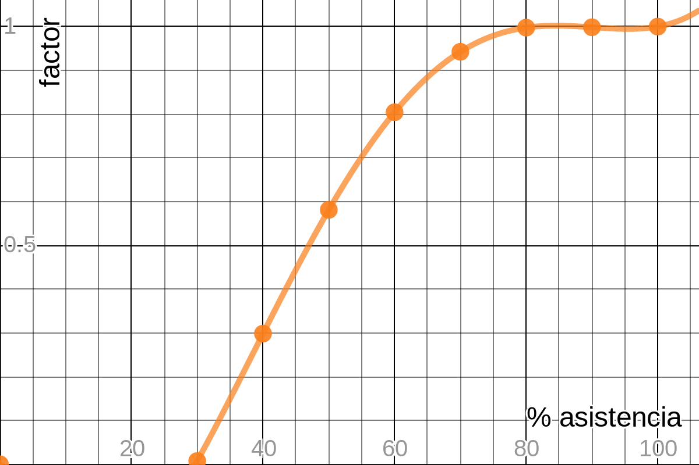

### Profesores

Nombre |  Correo |  Horario Atención | Ubicación 
-----|-----|-----|-----
Daira Velandia | daira.velandia@pucv.cl | Martes 16.00 - 17.00 hrs. | Oficina 2
Juan Zamora    | juan.zamora@pucv.cl | Martes 16.00 - 17.00 hrs. | Oficina 4

### Horarios de clases

Ubicación | Horario
-----|-----
Sala 5 | Lunes 14.00 hrs
Sala 5 | Lunes 15.40 hrs

### Contenidos

1. Operaciones matriciales
2. Descomposiciones matriciales
3. Métodos _directos_ para resolver sistemas de ecuaciones lineales
4. Métodos _iterativos_ para resolver sistemas de ecuaciones lineales
5. Ortogonalización y métodos de mínimos cuadrados
6. Procedimientos numéricos para el cálculo de valores y vectores propios

### Apuntes

* [Sesion 1](apuntes/ce3_01.pdf)
* [Sesion 2](apuntes/ce3_02.pdf)
* [Sesion 3](apuntes/ce3_03.pdf)

### Planificación de las sesiones

<iframe width="600" height="900" frameborder="0" src="https://docs.google.com/spreadsheets/d/e/2PACX-1vQCQkyLX4hJ5nZYrZsH_Xm9SvV7NHj8L7bhIR1MCZlNxAIRMDsbxUk9V-5OQMlhw8OOeuYNxb_sAHlj/pubhtml?gid=0&amp;single=true&amp;widget=true&amp;headers=false"></iframe>

### Evaluaciones del curso

La nota final del curso se compone de las notas de evaluaciones (3) y de los proyectos (2), más un factor que es determinado por el porcentaje de asistencia a clases.

* Para las unidades 2 y 3 del curso se entregará un proyecto a desarrollar (máximo 2 integrantes). Una serie de hitos de avance serán definidos previamente por cada proyecto junto con su respectiva fecha de evaluación. La nota de cada proyecto estará conformada por el promedio de notas de todos los hitos.

* La asistencia a clases es de carácter obligatorio. En base al porcentaje de asistencia se calculará un factor que ponderará la nota final. Para esto se usará la siguiente expresión sobre el porcentaje de sesiones asistidas __s__ (contenido entre 0% y 100%):

* Las 3 evaluaciones de cátedra junto con las notas de cada uno de los dos proyectos conformaran la nota final previa al examen se calcula como indica la expresión:

### Normas

* Cualquier entrega atrasada por más de 30 minutos o presentación no realizada tendrá la nota mínima (_1_).
* Entre cada par de sesiones consecutivas, se realizará un alto de 15 minutos.
* Los profesores entregaran los resultados de cada evaluación con un tiempo máximo de 2 semanas posterior a ella. 
* Las rúbricas de cada evaluación serán publicadas con anticipación de al menos 1 respecto de la fecha de rendición.

### Recursos disponibles

* Ver sección de [apuntes del curso](#apuntes)
* Gentle, J.E. (2007). Matrix Algebra: Theory, Computations and Applications in Statistics. Springer, New York.
* 
